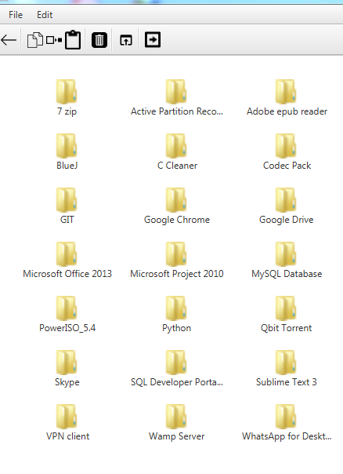

<h3>UXplore File Browser</h3>

A file explorer developed using JavaFX 2.0 and JDK 8 for educational purposes only.

It's able to browse files & folders as well as open, rename, delete, copy, cut, and paste them.

It uses the <a href="http://commons.apache.org/proper/commons-io/">Apache Commons IO Library</a> for performing some operations and it currently has no other dependencies.

<h4>Screenshots</h4>

